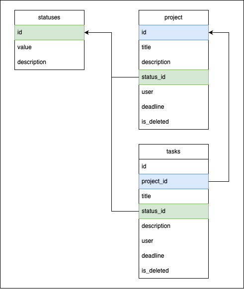

# task-manager (todo-list)

## Описание проекта
Проект направлен на разработку программного обеспечения для эффективного управления задачами с использованием API и календаря дедлайнов. Основная цель проекта — создание удобного инструмента для организации рабочего процесса, повышения продуктивности и улучшения качества управления проектами.

### Основные цели проекта
* Разработка API для взаимодействия с сервером, что обеспечит гибкость и масштабируемость системы.
* Создание системы классификации задач по проектам, позволяющей пользователям легко находить и управлять задачами в рамках конкретных проектов.
* Внедрение функции календаря для установки сроков выполнения задач, что повысит уровень самоорганизации и ответственности пользователей.

### Задачи проекта
* Анализ существующих решений и определение требований к разрабатываемому ПО.
* Разработка архитектуры системы с учетом требований безопасности и производительности.
* Реализация API для взаимодействия с сервером.
* Создание системы классификации задач по проектам.
* Разработка функционала календаря для установки сроков выполнения задач.
* Подготовка документации по использованию системы.

## Entity-Relationship Models

### Проекты



### Пользователи


## Настройка

   Создайте конфигурационный файл .env в папке src/ и заполните его по следующему примеру:

   ```.env
   SECRET_KEY=secret_key
   ALGORITHM=algorithm
   ACCESS_TOKEN_EXPIRE_MINUTES=minutes

   DB_USER=user_name
   DB_PSWD=your_password
   DB_HOST=host
   DB_PORT=5432
   DB_NAME=db_name
   ```

   1. SECRET_KEY<span style="color:red">*</span><br>
   Создайте случайный секретный ключ, который будет использоваться для подписи токенов JWT.
   Вы можете получить его с помощью следующего скрипта bash:
   ```bash
   openssl rand -hex 32
   ```

   2. ALGORITHM<span style="color:red">*</span><br>
   Используется для подписи токена JWT
   Алгоритмы шифрования можно найти на сайте [jwt.io](https://jwt.io/) и выбрать среди них следующие:
       - HS256
       - HS384
       - HS512


   3. ACCESS_TOKEN_EXPIRE_MINUTES<span style="color:red">*</span><br>
   Срок жизни токена JWT, измеряется в минутах.


   4. Базы данных<span style="color:red">*</span><br>